# Awesome HTML PPT

[](https://awesome.re)
[](LICENSE)
[](data/skills.json)

[中文](README.md) · [English](README.en.md)

持续收集全网**做得最好的 HTML 幻灯片 / PPT Agent Skills 与相关仓库**，按上台场景整理，给 Cursor / Claude Code / Codex 用：装一个 skill，让模型按设计系统出片，而不是从空白 HTML 瞎编。

本列表会跟着生态更新。**欢迎投稿**（别人的仓库、你自己写的都算）。

**[图鉴 Gallery](https://nickylin.github.io/awesome-html-ppt/)** · **[投稿 Submit](https://github.com/nickylin/awesome-html-ppt/issues/new?template=submit-skill.yml)**

> 不要只看星标。2.4 万的「杂志风」和 8 千的「演讲者模式」解决的是不同的上台问题。

## 一眼看效果

<table>
  <tr>
    <td width="50%">
      <a href="https://github.com/zarazhangrui/frontend-slides">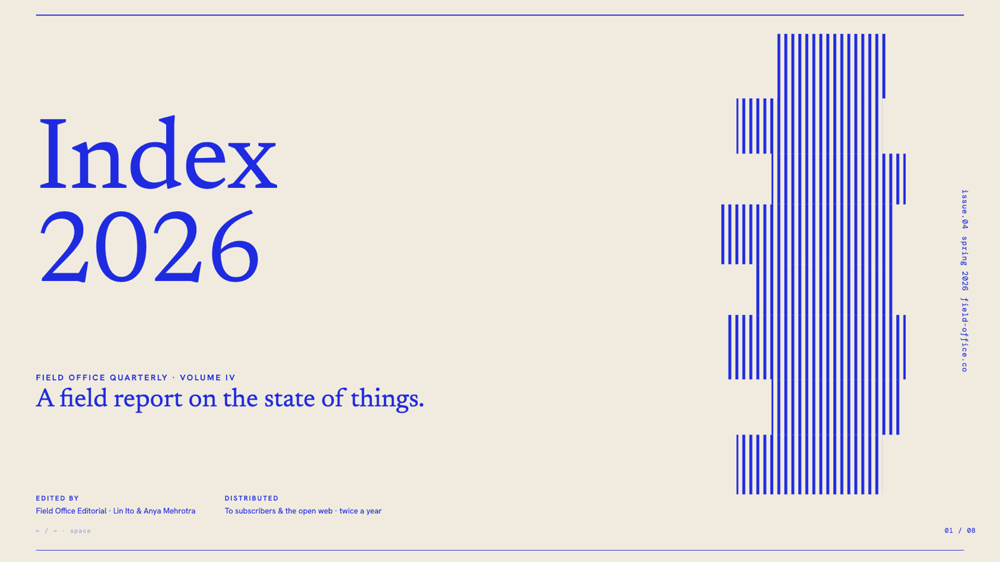</a>
      <p><strong><a href="https://github.com/zarazhangrui/frontend-slides">Frontend Slides</a></strong> · 29,179★<br>先出 3 套视觉预览再定稿。</p>
    </td>
    <td width="50%">
      <a href="https://github.com/op7418/guizang-ppt-skill">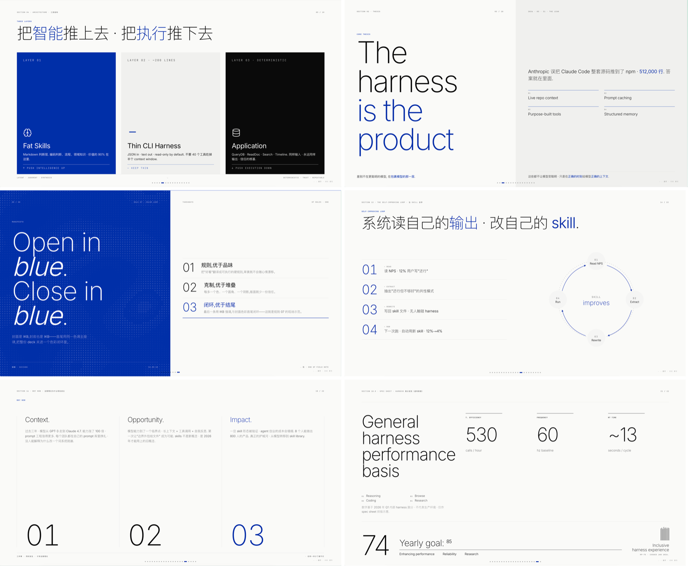</a>
      <p><strong><a href="https://github.com/op7418/guizang-ppt-skill">Guizang PPT</a></strong> · 26,169★ · AGPL<br>电子杂志 × 瑞士国际主义。</p>
    </td>
  </tr>
  <tr>
    <td width="50%">
      <a href="https://github.com/alchaincyf/huashu-design"></a>
      <p><strong><a href="https://github.com/alchaincyf/huashu-design">Huashu Design</a></strong> · 24,086★<br>HTML 演示 + 可编辑 PPTX。</p>
    </td>
    <td width="50%">
      <a href="https://github.com/lewislulu/html-ppt-skill">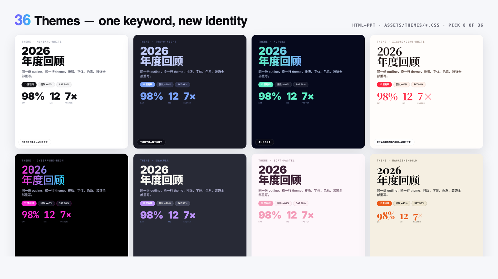</a>
      <p><strong><a href="https://github.com/lewislulu/html-ppt-skill">HTML PPT Studio</a></strong> · 8,333★<br>36 主题 · S 键演讲者窗。</p>
    </td>
  </tr>
  <tr>
    <td width="50%">
      <a href="https://github.com/1weiho/open-slide">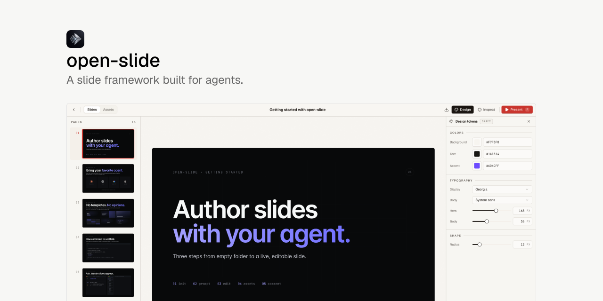</a>
      <p><strong><a href="https://github.com/1weiho/open-slide">open-slide</a></strong> · 7,564★<br>React 画布，适合反复改。</p>
    </td>
    <td width="50%">
      <a href="https://github.com/nicobailon/visual-explainer">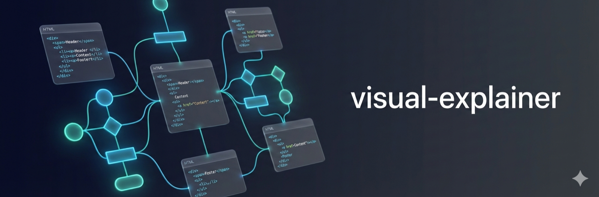</a>
      <p><strong><a href="https://github.com/nicobailon/visual-explainer">Visual Explainer</a></strong> · 9,798★<br>diff / 复盘 / 数据表。</p>
    </td>
  </tr>
</table>

## 30 秒怎么选

| 你要… | 装这个 | Stars |
| --- | --- | ---: |
| 线下分享、杂志感 / 瑞士网格 | [guizang-ppt-skill](https://github.com/op7418/guizang-ppt-skill) **AGPL-3.0** | 26,169 |
| 先看 3 套预览再定稿 | [frontend-slides](https://github.com/zarazhangrui/frontend-slides) | 29,179 |
| 主题库 + 真演讲者窗 | [html-ppt-skill](https://github.com/lewislulu/html-ppt-skill) | 8,333 |
| 同一套片反复改 | [open-slide](https://github.com/1weiho/open-slide) | 7,564 |
| 同时交 HTML **和** 可编辑 PPTX | [huashu-design](https://github.com/alchaincyf/huashu-design) | 24,086 |
| diff / 架构复盘 | [visual-explainer](https://github.com/nicobailon/visual-explainer) | 9,798 |

## 什么是 HTML PPT Skill

一份可被 agent 加载的包装：通常是 `SKILL.md` + 主题 / 版式 + 一小段 runtime。模型按它写出 **浏览器能直接翻页** 的幻灯片。

- **源格式是 HTML**（可版本管理、可投影、可嵌图嵌代码）
- 多数 **单文件、零构建**；[open-slide](https://github.com/1weiho/open-slide) 是例外（React 框架）
- PPTX 只是导出，不是工作区

## Tier S · 先看这 7 个

星标断层很明显：前三都在 2.4 万以上。

### 1. [zarazhangrui/frontend-slides](https://github.com/zarazhangrui/frontend-slides) · 29,179★ · MIT

生态起点。不让你用形容词描述审美，而是 **生成 3 套视觉预览** 再让你挑。可从 PPTX 转入，Playwright 出 PDF。

模板库 sibling：[beautiful-html-templates](https://github.com/zarazhangrui/beautiful-html-templates)。


### 2. [op7418/guizang-ppt-skill](https://github.com/op7418/guizang-ppt-skill) · 26,169★ · AGPL-3.0

视觉气质最稳。两套旗舰：

- **Style A 电子杂志 × 电子墨水** — 叙事、观点、个人分享
- **Style B 瑞士国际主义** — 网格、单一高饱和锚点色、产品/方法论

带配图/封面、排练和演讲者模式。不适合密表、培训手册。二次分发前先读 AGPL。

```bash
npx skills add https://github.com/op7418/guizang-ppt-skill --skill guizang-ppt-skill
```


### 3. [alchaincyf/huashu-design](https://github.com/alchaincyf/huashu-design) · 24,086★ · MIT

不只是 PPT skill：同一套设计哲学出 **HTML 演示 + 可编辑 PPTX**（文本框保留），还能做原型、Infographic、MP4。范围比纯幻灯片 skill 大。

```bash
npx skills add alchaincyf/huashu-design
```


### 4. [nicobailon/visual-explainer](https://github.com/nicobailon/visual-explainer) · 9,798★ · MIT

技术内容向：diff review、计划审计、数据表、项目复盘。四套暗色优先美学。不是 pitch deck 首选。


### 5. [lewislulu/html-ppt-skill](https://github.com/lewislulu/html-ppt-skill) · 8,333★ · MIT

功能清单最满：36 主题、15 整套模板、31 版式、47 动画。`S` 键弹出演讲者窗：当前页 / 下一页 / 逐字稿 / 计时器。纯静态 HTML，无构建。

```bash
npx skills add https://github.com/lewislulu/html-ppt-skill
```


### 6. [1weiho/open-slide](https://github.com/1weiho/open-slide) · 7,564★ · MIT · [open-slide.dev](https://open-slide.dev)

**React 框架**，不是纯 `SKILL.md`。每页任意 React 组件，固定 1920×1080。点选批注 → `/apply-comments`。适合长期维护同一套片。

```bash
npx @open-slide/cli init my-slide
```


### 7. [zarazhangrui/beautiful-html-templates](https://github.com/zarazhangrui/beautiful-html-templates) · 4,545★ · MIT

纯模板库，无生成逻辑。32+ 套，每套 3 页示范不同版式职责。很多 skill 拿它当视觉真值。

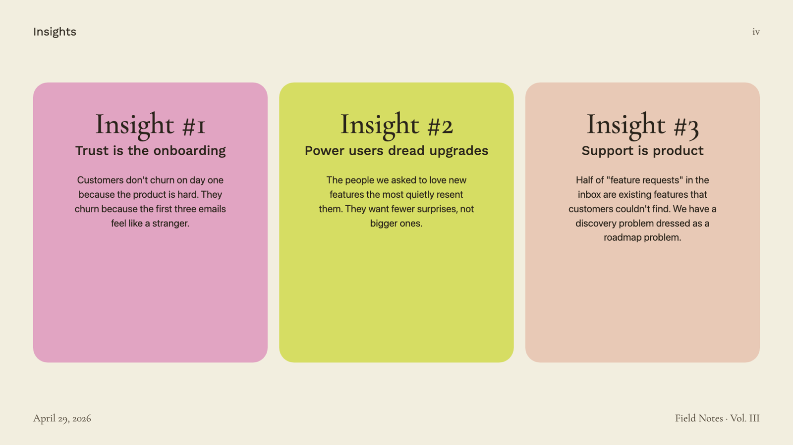

## 功能对照

| Skill | 输出 | 演讲者 | PPTX | 最适合 |
| --- | --- | --- | --- | --- |
| guizang-ppt-skill | 单文件 HTML | 排练 + 演讲者 | 否 | 线下分享 |
| frontend-slides | 单文件 HTML | 键鼠翻页 | 可转 | 从零做片 |
| huashu-design | HTML + PPTX | 浏览器演示 | 是 | 双交付 |
| html-ppt-skill | 静态 HTML | S 键真演讲者窗 | 否 | 上台带讲稿 |
| open-slide | React 画布 | 当前/下一页 + notes | HTML/PDF | 反复改稿 |
| visual-explainer | HTML 页或 deck | 键鼠翻页 | 否 | 技术复盘 |
| frontend-slides-editable | 可拖拽 HTML | 键鼠翻页 | PPTX→Web | 生成后再改 |

完整机器可读表：[data/skills.json](data/skills.json)

## Tier A · 生产可用

<table>
  <tr>
    <td width="50%">
      <a href="https://github.com/mucsbr/ppt-agent-workflow-san">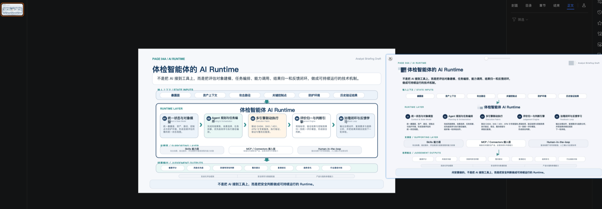</a>
      <p><strong><a href="https://github.com/mucsbr/ppt-agent-workflow-san">ppt-agent-workflow-san</a></strong> · 638★<br>渐进交互：计划 → HTML → PPTX，导出是一等公民。</p>
    </td>
    <td width="50%">
      <a href="https://github.com/archlizheng/frontend-slides-editable">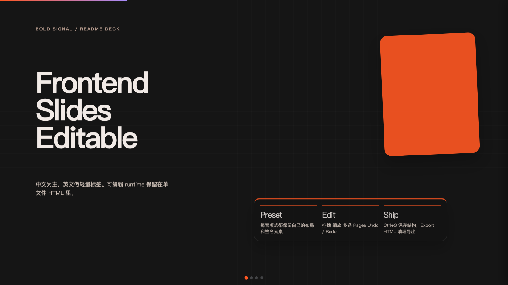</a>
      <p><strong><a href="https://github.com/archlizheng/frontend-slides-editable">Frontend Slides Editable</a></strong> · 497★ · MIT<br>frontend-slides 可编辑 fork：拖拽、改字、重排。</p>
    </td>
  </tr>
  <tr>
    <td width="50%">
      <a href="https://github.com/vigorX777/ppt-svg-generator"></a>
      <p><strong><a href="https://github.com/vigorX777/ppt-svg-generator">ppt-svg-generator</a></strong> · 258★ · MIT<br>Markdown → HTML/PDF。五套风格。</p>
    </td>
    <td width="50%">
      <a href="https://github.com/Akxan/ppt-agent-skill">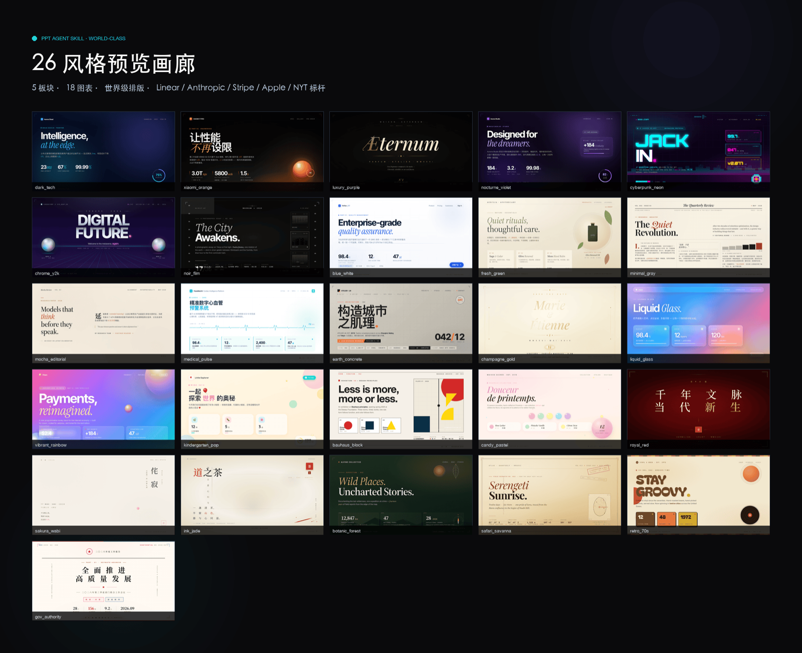</a>
      <p><strong><a href="https://github.com/Akxan/ppt-agent-skill">ppt-agent-skill</a></strong> · 147★ · MIT<br>26 风格 · 18 图表，对标真实品牌 CSS。</p>
    </td>
  </tr>
  <tr>
    <td width="50%">
      <a href="https://github.com/bytonylee/future-slide-skill">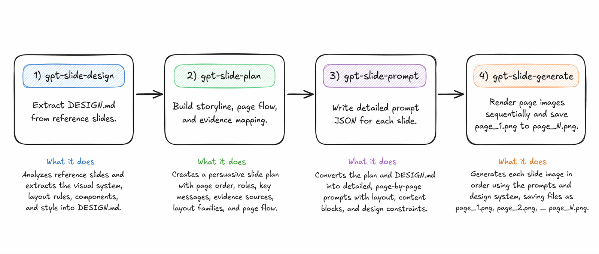</a>
      <p><strong><a href="https://github.com/bytonylee/future-slide-skill">future-slide-skill</a></strong> · 147★ · Apache-2.0<br>同一 IR 切 HTML 现场片或图片轮播。</p>
    </td>
    <td width="50%"></td>
  </tr>
</table>

## Tier B · 专项

星少不代表弱。这些往往是 **某个场景的最佳解**。

<table>
  <tr>
    <td width="50%">
      <a href="https://github.com/software-ai-life/Awesome-PPT-Design-Skills">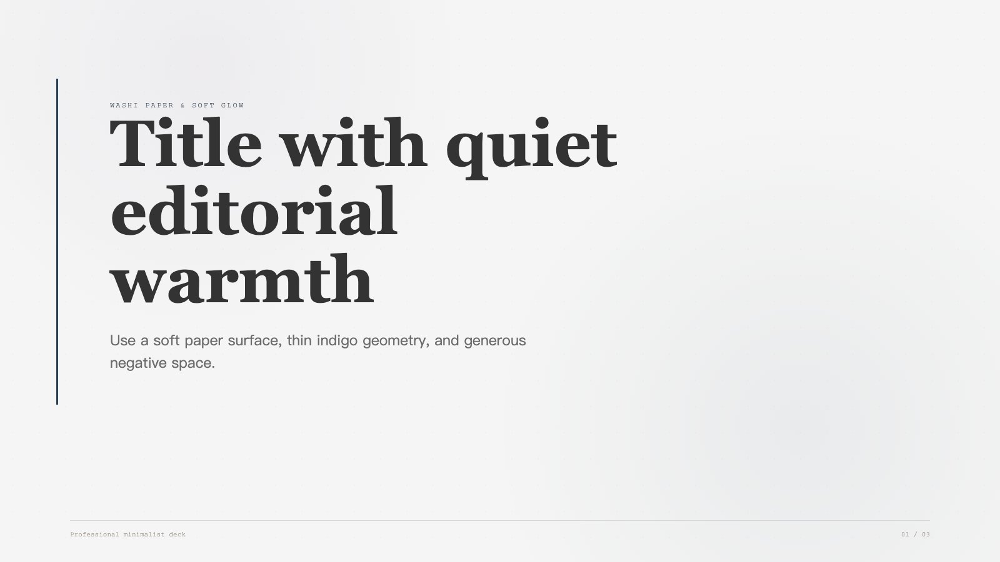</a>
      <p><strong><a href="https://github.com/software-ai-life/Awesome-PPT-Design-Skills">Awesome PPT Design Skills</a></strong> · 103★<br>多风格包，繁中一等公民。</p>
    </td>
    <td width="50%">
      <a href="https://github.com/edu-ai-builders/visual-cognition-slides"></a>
      <p><strong><a href="https://github.com/edu-ai-builders/visual-cognition-slides">Visual Cognition Slides</a></strong> · 83★ · MIT<br>教学留存，不是商业 pitch。</p>
    </td>
  </tr>
  <tr>
    <td width="50%">
      <a href="https://github.com/zuiho-kai/huawei-style-ppt-skill">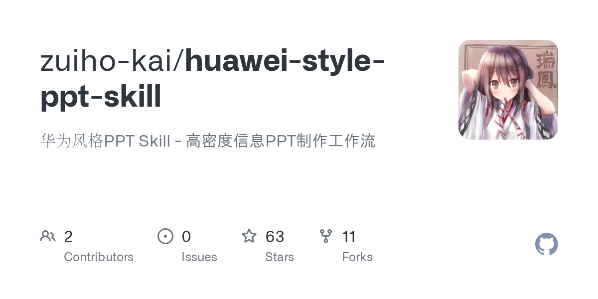</a>
      <p><strong><a href="https://github.com/zuiho-kai/huawei-style-ppt-skill">Huawei-style PPT</a></strong> · 63★<br>华为风高密度战略页。</p>
    </td>
    <td width="50%">
      <a href="https://github.com/WayneZhon/KingDee-PPT-Skill"></a>
      <p><strong><a href="https://github.com/WayneZhon/KingDee-PPT-Skill">KingDee PPT</a></strong> · 56★ · MIT<br>金蝶官方模板语言。Classic / Bento Motion。</p>
    </td>
  </tr>
  <tr>
    <td width="50%">
      <a href="https://github.com/codesstar/next-slide">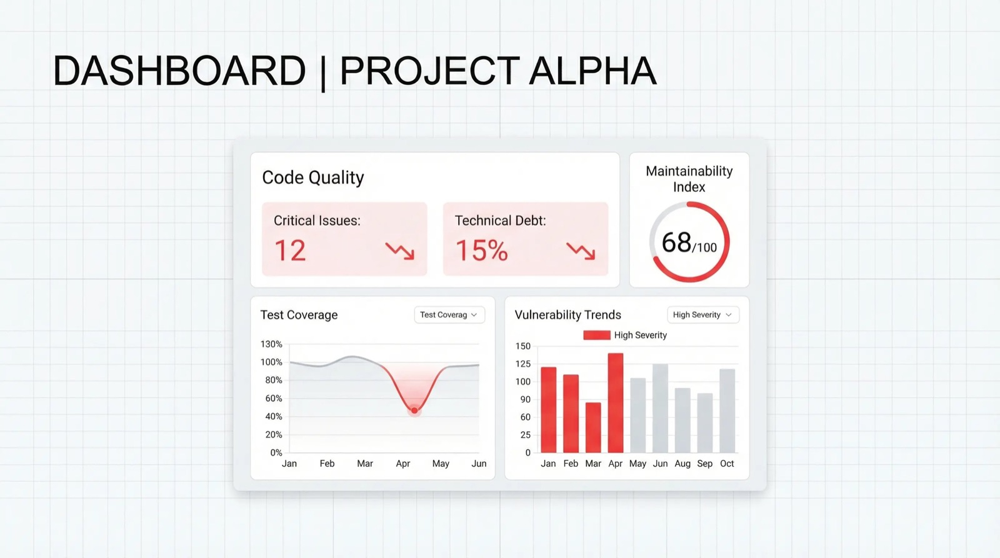</a>
      <p><strong><a href="https://github.com/codesstar/next-slide">next-slide</a></strong> · 50★ · MIT<br>26+ 设计系统，中英双语。</p>
    </td>
    <td width="50%">
      <a href="https://github.com/kaisersong/slide-creator">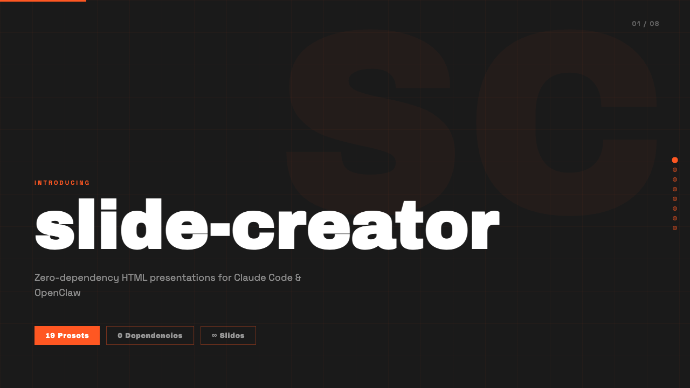</a>
      <p><strong><a href="https://github.com/kaisersong/slide-creator">slide-creator</a></strong> · 49★<br>IR 先行 + 16 项内容审查。</p>
    </td>
  </tr>
  <tr>
    <td width="50%">
      <a href="https://github.com/FeeiCN/slide-writer"></a>
      <p><strong><a href="https://github.com/FeeiCN/slide-writer">slide-writer</a></strong> · 41★ · MIT<br>企业风，自动套国内大厂主题。</p>
    </td>
    <td width="50%">
      <a href="https://github.com/Phlegonlabs/Powerpoint-fancy-design">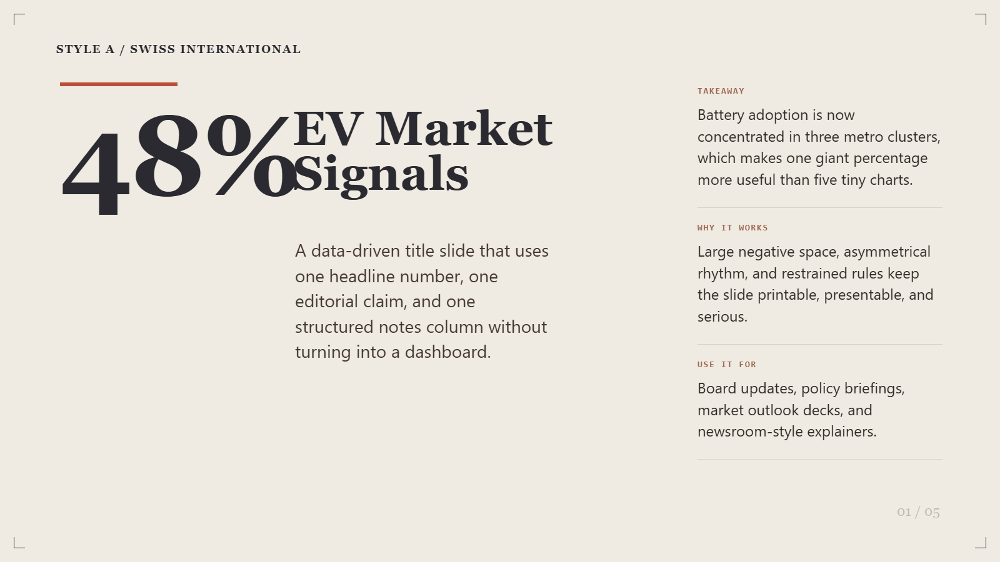</a>
      <p><strong><a href="https://github.com/Phlegonlabs/Powerpoint-fancy-design">Powerpoint fancy design</a></strong> · 33★<br>HTML + PNG + PPTX，中英字体。</p>
    </td>
  </tr>
  <tr>
    <td width="50%">
      <a href="https://github.com/nghiahsgs/skills-slides">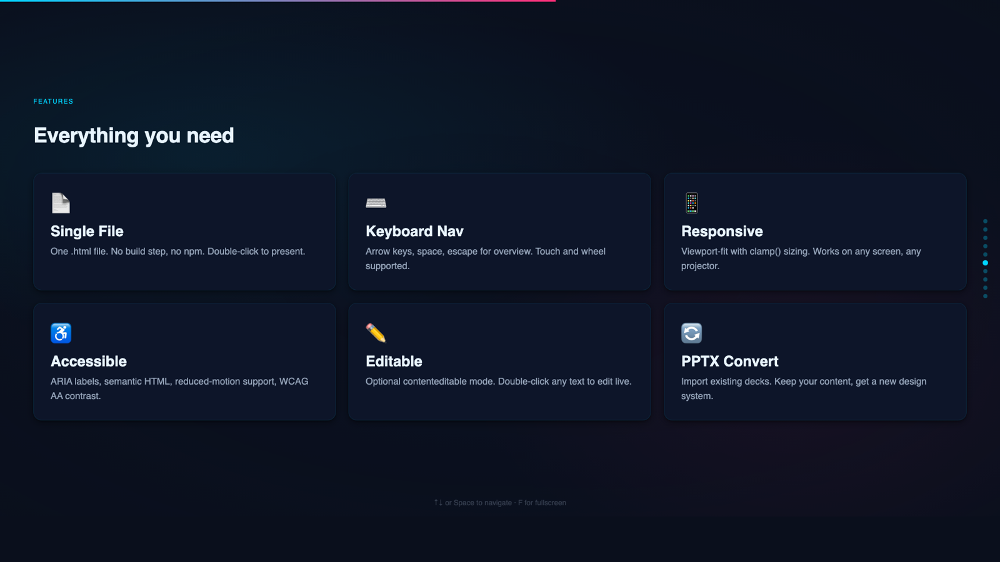</a>
      <p><strong><a href="https://github.com/nghiahsgs/skills-slides">skills-slides</a></strong> · 32★<br>token 系统 + anti-slop 清单。</p>
    </td>
    <td width="50%">
      <a href="https://github.com/xhshow2025/-PPT-sense-deck-skill-"></a>
      <p><strong><a href="https://github.com/xhshow2025/-PPT-sense-deck-skill-">鲸格 PPT / sense-deck</a></strong> · 23★<br>演讲者 + 可编辑 + 手势。</p>
    </td>
  </tr>
</table>

## Cursor 安装

Skills 放进项目 `.cursor/skills/<name>/SKILL.md`，或用户目录 `~/.cursor/skills/`。Cursor 也会读 `~/.claude/skills/`。

```bash
npx skills add https://github.com/lewislulu/html-ppt-skill

git clone https://github.com/op7418/guizang-ppt-skill.git ~/.cursor/skills/guizang-ppt-skill
```

对话里用 `/skill-name`，或直接说「做一份 HTML PPT」。

刷新本仓库星标：

```bash
python3 scripts/refresh-stars.py
```

## Related（不是 HTML 优先）

| Repo | ★ | 为什么在这 |
| --- | ---: | --- |
| [likaku/Mck-ppt-design-skill](https://github.com/likaku/Mck-ppt-design-skill) | 274 | 麦肯锡风 python-pptx，源格式不是 HTML |
| [ToseaAI/awesome-html-slide-skills](https://github.com/ToseaAI/awesome-html-slide-skills) | 146 | 更早的公开目录。本列表按使用场景重排 |

## 持续收录 · 欢迎投稿

这个仓库不是一次性榜单：全网扫公开的 HTML PPT skill / 模板 / 框架，按「适不适合上台、是否 HTML 优先、有没有真实 `SKILL.md`」筛选后再写进列表和图鉴。

1. **[提交 Issue（投稿模板）](https://github.com/nickylin/awesome-html-ppt/issues/new?template=submit-skill.yml)** — 最快
2. Pull Request，同时改 README 和 [`data/skills.json`](data/skills.json)
3. 细则见 [CONTRIBUTING.md](CONTRIBUTING.md)

不一定要高星；教学、企业模板、可编辑、HTML→PPTX 同样欢迎。

## License

编排与文案 [CC BY 4.0](LICENSE)。被链仓库保留各自许可证。预览图来自各项目 README / demo，版权归原作者，仅用于辨认。
